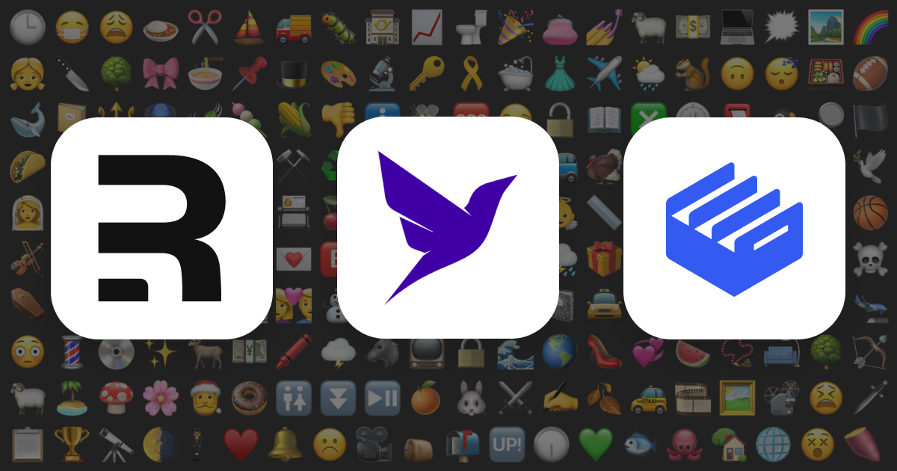

# Movie Emoji Quiz App

This sample repo is associated with the [Remix, Fauna, and Clerk tutorial](https://clerk.dev/tutorials/build-movie-emoji-quiz-with-remix-fauna-and-clerk).

You can browse the code and run it locally, or you can check out the [live demo](https://remix-fauna-tutorial.clerk.app).



## Development

To run your Remix app locally, make sure your project's local dependencies are installed:

```sh
npm install
```

Afterwards, start the Remix development server like so:

```sh
npm run dev
```

Open up [http://localhost:3000](http://localhost:3000) and you should be ready to go!

## Deployment

After having run the `create-remix` command and selected "Vercel" as a deployment target, you only need to [import your Git repository](https://vercel.com/new) into Vercel, and it will be deployed.

If you'd like to avoid using a Git repository, you can also deploy the directory by running [Vercel CLI](https://vercel.com/cli):

```sh
npm i -g vercel
vercel
```
## Contact

If you need support or have anything you would like to ask, please reach out in our [Discord channel](https://discord.com/invite/b5rXHjAg7A). We'd love to chat!